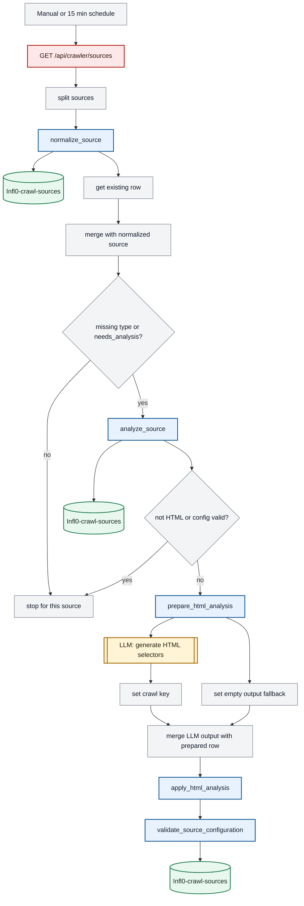
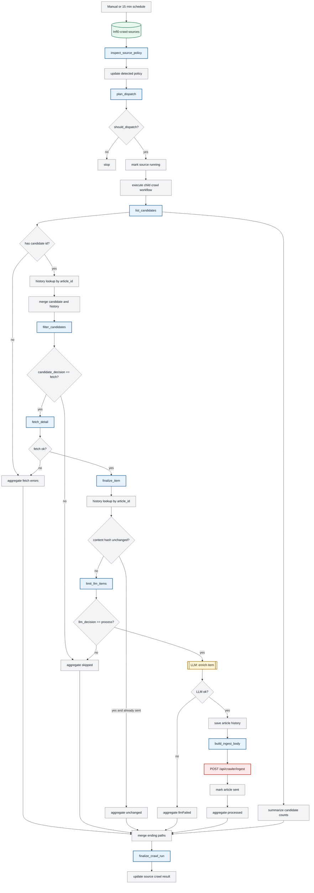
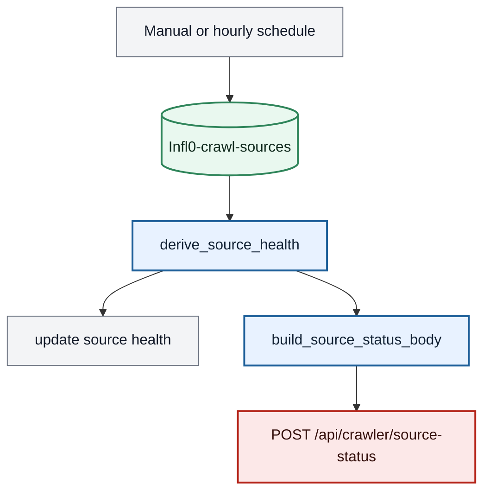
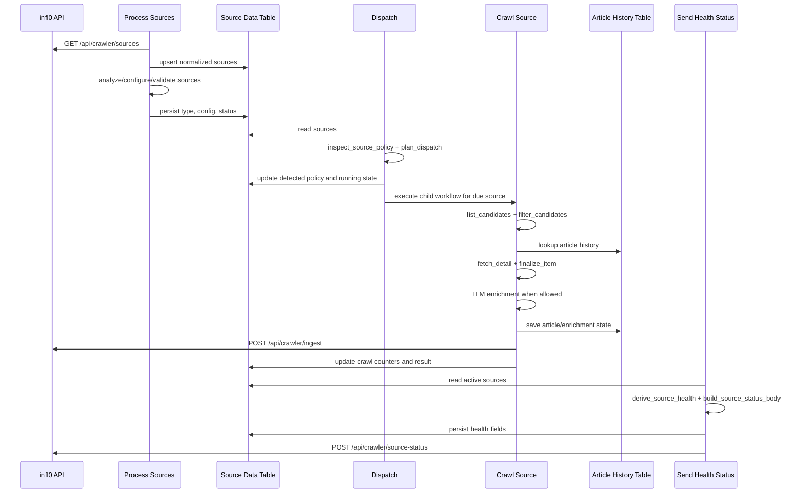

# Workflow Diagram

The production n8n setup is four workflows, not one long linear workflow. Python provides the reusable `tkcrawler.steps` functions; n8n owns scheduling, Data Table reads/writes, child workflow execution, LLM calls and HTTP calls to infl0.

LLM calls are orchestrator-owned steps. Python prepares inputs and consumes structured outputs, but does not call a model itself.

## System Overview

```mermaid
flowchart TD
    P1["Workflow 1: Process Sources"]
    P2["Workflow 2: Dispatch"]
    P3["Workflow 3: Crawl Source"]
    P4["Workflow 4: Send Health Status"]

    T1[("Infl0-crawl-sources")]
    T2[("infl0-articles history")]
    H1["GET /api/crawler/sources"]
    H2["POST /api/crawler/ingest"]
    H3["POST /api/crawler/source-status"]
    L1[["LLM: HTML selectors"]]
    L2[["LLM: item enrichment"]]

    H1 --> P1
    P1 --> T1
    P1 -. "HTML config path" .-> L1
    T1 --> P2
    P2 --> P3
    P3 <--> T2
    P3 -. "enrichment path" .-> L2
    P3 --> H2
    P3 --> T1
    T1 --> P4
    P4 --> H3

    classDef llm fill:#fff4d6,stroke:#a66a00,stroke-width:2px,color:#2b2110
    classDef tkc fill:#e8f2ff,stroke:#1d5f99,stroke-width:2px,color:#102033
    classDef platform fill:#f3f4f6,stroke:#6b7280,stroke-width:1px,color:#111827
    classDef table fill:#e9f8ef,stroke:#2f855a,stroke-width:2px,color:#102a1d
    classDef http fill:#fce8e8,stroke:#b42318,stroke-width:2px,color:#35100c

    class L1,L2 llm
    class P1,P2,P3,P4 platform
    class T1,T2 table
    class H1,H2,H3 http
```

## Workflow 1: Process Sources



## Workflow 2 and 3: Dispatch and Crawl



## Workflow 4: Send Health Status



## Node Kinds

The diagram uses these categories:

- TKC Python calls: n8n Python Code nodes that call `tkcrawler` functions.
- Platform steps: native n8n triggers, IF nodes, Merge/Set/Split/Aggregate nodes, Execute Workflow, and other orchestration-only steps.
- LLM calls: n8n AI/LangChain nodes. Python prepares input or consumes output, but does not call the model.
- Data Tables: n8n persistence for sources and article history.
- infl0 HTTP calls: API calls to infl0.

## TKC Calls

These are the workflow steps that call TopicKnowledgeCrawler code directly:

| Workflow | Step | TKC function/module |
| --- | --- | --- |
| Process Sources | `normalize_source` | `tkcrawler.steps.normalize_source.normalize_source_item` |
| Process Sources | `analyze_source` | `tkcrawler.steps.analyze_source.analyze_source_item` |
| Process Sources | `prepare_html_analysis` | `tkcrawler.steps.prepare_html_analysis.prepare_html_analysis_item` |
| Process Sources | `apply_html_analysis` | `tkcrawler.steps.apply_html_analysis.apply_html_analysis_item` |
| Process Sources | `validate_source_configuration` | `tkcrawler.steps.validate_source_configuration.validate_source_configuration_item` |
| Dispatch | `inspect_source_policy` | `tkcrawler.steps.inspect_source_policy.inspect_source_policy_item` |
| Dispatch | `plan_dispatch` | `tkcrawler.steps.plan_dispatch.plan_dispatch_item` |
| Crawl Source | `list_candidates` | `tkcrawler.steps.list_candidates.list_candidates_items` |
| Crawl Source | `filter_candidates` | `tkcrawler.steps.filter_candidates.filter_candidate_item` |
| Crawl Source | `fetch_detail` | `tkcrawler.steps.fetch_detail.fetch_detail_item` |
| Crawl Source | `finalize_item` | `tkcrawler.steps.finalize_item.finalize_item` |
| Crawl Source | `limit_llm_items` | `tkcrawler.steps.limit_llm_items.limit_llm_items` |
| Crawl Source | `build_ingest_body` | `tkcrawler.steps.build_ingest_body.build_ingest_body_item` or `tkcrawler.infl0_payload.build_ingest_body` |
| Crawl Source | `finalize_crawl_run` | `tkcrawler.steps.finalize_crawl_run.finalize_crawl_run_item` |
| Send Health Status | `derive_source_health` | `tkcrawler.steps.derive_source_health.derive_source_health_item` |
| Send Health Status | `build_source_status_body` | `tkcrawler.steps.build_source_status_body.build_source_status_body_item` |

## Platform Steps

These are pure n8n/platform steps. They coordinate data but should not contain crawler business logic:

| Workflow | Platform responsibilities |
| --- | --- |
| Process Sources | manual/schedule trigger, source API request, split sources, source table upsert/get/update, merge with existing rows, IF routing, Set fallback output |
| Dispatch | manual/schedule trigger, source table read/update, IF `should_dispatch`, mark source running, Execute Workflow child call, no-op branch |
| Crawl Source | ExecuteWorkflow/manual triggers, test fixture nodes, Data Table history lookups/upserts, Merge nodes, IF routing, Set nodes, Aggregate nodes, candidate-count summarization, article sent marking, source crawl-result update |
| Send Health Status | manual/hourly trigger, source table read/update, HTTP POST to source-status |

The LLM nodes and infl0 HTTP calls are platform-owned too, but they are called out separately because they are external boundaries with dedicated contracts.

## Abstract Domain Sequence

The four n8n workflows implement this domain sequence across schedulers, Data Tables and child workflow calls:



## LLM Prompt Outlines

Detailed prompt examples live in [`n8n/docs/AI_PROMPTS.md`](../n8n/docs/AI_PROMPTS.md). The workflow expects these model calls to return valid JSON so the following Python step can parse and validate the result.

### Generate HTML Selectors

Purpose: inspect a compacted HTML listing page and identify selectors that let `list_candidates` find article links later.

Called in: Workflow 1, `process sources`.

Input prepared by `prepare_html_analysis`:

- source URL
- compacted HTML with scripts/styles removed
- prompt text in `html_analysis_prompt`

Expected JSON shape:

```json
{
  "article_selector": "CSS selector matching each repeated article/listing item",
  "main_page_anchor_selector": "CSS selector, relative to each article item, matching the detail-page <a>",
  "confidence": "high",
  "notes": "short explanation"
}
```

Prompt outline:

- Return JSON only, without Markdown fences.
- Prefer short structural selectors.
- The anchor selector must match an `<a>` element.
- Do not depend on tracking query parameters or unique URLs.
- If no articles are found, return empty selectors and low confidence.

The result is consumed by `apply_html_analysis`, which persists `configuration_json` with `article_selector` and `main_page_anchor_selector`.

### Enrich Item

Purpose: turn finalized article or episode content into user-facing metadata for infl0.

Called in: Workflow 3, `crawl source`.

Input prepared by `fetch_detail` and `finalize_item`:

- `article.content_md`
- source/item metadata
- `item_kind` such as `article` or `episode`

Expected JSON shape:

```json
{
  "teaser": "short teaser under 200 characters",
  "summary_long": "concise summary in the item's language",
  "category": ["factual information"],
  "tags": ["topic", "keyword"],
  "seriousness_rating": "high"
}
```

Prompt outline:

- Preserve the language of the source item.
- Produce an engaging but faithful summary.
- Pick one or more documented categories.
- Rate seriousness as `high`, `medium` or `low`.
- Return valid JSON only.

The result is merged into the item before `build_ingest_body`.

Related docs:

- `docs/TARGET_ARCHITECTURE.md`
- `docs/IMPLEMENTATION_PLAN.md`
- `n8n/docs/WORKFLOW.md`
- `n8n/docs/AI_PROMPTS.md`
